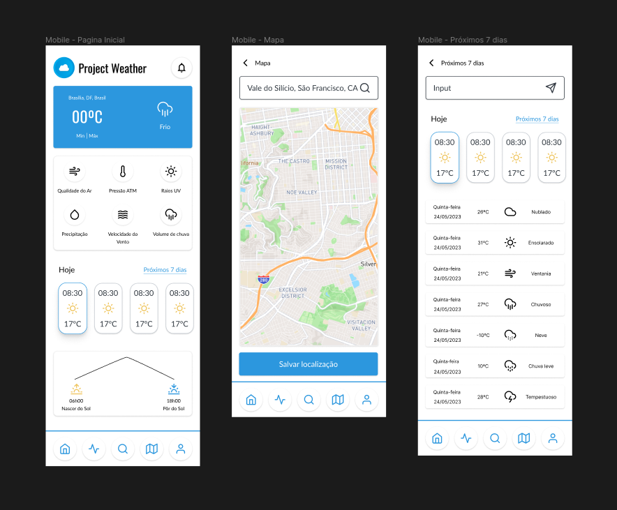

<h1 align="center"> Project: Weather </h1>

<p align="center">
Uma aplicação web de previsão do tempo para auxiliar em tarefas a curto e longo prazo, feita com React.JS e Styled Components.
</p>

<p align="center">
  <a href="#-tecnologias">Tecnologias</a>&nbsp;&nbsp;&nbsp;|&nbsp;&nbsp;&nbsp;
  <a href="#-projeto">Projeto</a>&nbsp;&nbsp;&nbsp;|&nbsp;&nbsp;&nbsp;
  <a href="#-layout">Layout</a>&nbsp;&nbsp;&nbsp;|&nbsp;&nbsp;&nbsp;
  <a href="#memo-licença">Licença</a>
</p>

<p align="center">
  
</p>

<br>

<p align="center">
  
</p>

## 🚀 Tecnologias

Esse projeto foi desenvolvido com as seguintes tecnologias:

- HTML5, CSS3, JS ES6+
- [Node e Yarn](https://nodejs.org/)
- [Create react-app](https://Reactjs.org/docs/api-reference/create-React-app)
- [React.JS](https://react.dev/learn)
- [React Router DOM](https://reactrouter.com/en/main)
- [React Lottie](https://www.npmjs.com/package/react-lottie)
- [React Icons](https://www.npmjs.com/package/react-icons)
- [React Hot Toast](https://www.npmjs.com/package/react-hot-toast)
- [Typescript](https://www.typescriptlang.org/docs/)
- [Styled Components](https://styled-components.com/docs)
- [Axios](https://axios-http.com/ptbr/docs/intro)
- [ESLint](https://eslint.org/docs/latest/)
- [Prettier](https://prettier.io/docs/en/index.html)
- [Husky](https://typicode.github.io/husky/#/)
- [Lint-Staged](https://valchan.com.br/lint-staged-husky/)
- [Dotenv](https://www.npmjs.com/package/dotenv)
- [Zod](https://www.npmjs.com/package/zod)

## 💻 Projeto

Este projeto é voltado para a previsão do tempo buscando atender o maior número de possíveis usuários como pessoas comuns, profissionais, viajantes, equipes de resgate, pesquisadores, empresas e entusiastas do clima. O aplicativo é projetado para ter um interface simples e intuitiva para exibir informações básicas sobre o tempo, práticas de atividades ao ar livre e planejamento de viagens.

O objetivo principal do projeto é fornecer aos usuários informações precisas e atualizadas sobre as condições climáticas, isso pode incluir informações sobre temperatura, umidade, precipitação, ventos, entre outros fatores relevantes, alertas de clima severo, mapas meteorológicos interativos e previsões de longo prazo e ajudar os usuários a tomarem decisões informadas com base nas condições climáticas, melhorando assim sua segurança e bem-estar.

Além disso a aplicação deseja oferecer além de boa interface com informações precisas, opções de personalização, alertas meteorológicos, previsão do tempo a longo prazo, informações adicionais como qualidade do ar, índices de raios UV e assim por diante também mirando no acesso offline dessas informações.

## 🏡 Comandos de execução no projeto

Instalação das dependências do projeto

```sh
yarn
```

Inicialização da aplicação

```sh
yarn start
```

Build da aplicação

```sh
yarn build
```

## 🔖 Layout

Você pode visualizar o layout do projeto clicando [aqui](https://www.figma.com/file/9Cx6jH0RyS2MdKzLuT1DX1/Project-Weather?type=design&node-id=5-3&t=hHrWK23PFmBJdOqw-0). É necessário ter conta no [Figma](https://figma.com) para acessá-lo.

<p align="center">
  
</p>

## 📝 Licença

Esse projeto está sob a licença MIT.

---
